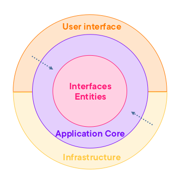
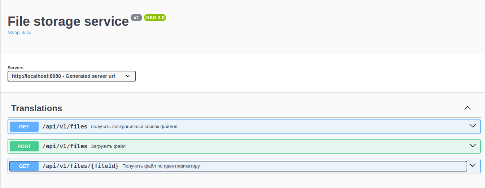

# File Storage Service

На вход методу отправляется JSON, включающий в себя файл (в формате base64) и его атрибуты (название - title, дата и время отправки - creation_date, краткое описание документа - description), на выходе метод возвращает id созданного файла.

---

# Реализация

При разработке и проектировании проекта применялась идеология чистой архитектуры с шаблоном CQRS.



## А. Описание решения:
В ТЗ указано, что файл передается в формате (base64), и, соответственно, содержимое файла в любом случае является текстом. В моем решении сам файл хранится в файловой системе, но его атрибуты, такие как название и описание, хранятся в СУБД PostgreSQL.

Для того чтобы отправить запрос на сохранение файла, необходимо отправить HTTP-запрос с методом POST, где в теле запроса должны быть следующие поля:
1. **content**: Содержимое файла (не должно быть пустым, иначе ошибка 400 при запросе на сервер).
2. **title**: Название файла (не должно быть пустым или превышать 60 символов, иначе ошибка 400 при запросе на сервер).
3. **description**: Описание файла (не должно быть пустым или превышать 256 символов, иначе ошибка 400 при запросе на сервер).

Время загрузка файла устанавливается системой, когда файл и его атрибуты сохранился успешно.

При успешном запросе сервер возвращает код успеха 201, а в теле ответа — ID сохраненного файла. Пример успешного запроса к серверу выглядит следующим образом:

```shell
curl -X 'POST' \
  'http://localhost:8080/api/v1/files' \
  -H 'Content-Type: application/json' \
  -d '{
  "content": "file base64 content",
  "title": "file title",
  "description": "file description"
}'
```

Ответ от сервера выглядит следующим образом:
```shell
{
  "fileId": "65a4fbdb-75d2-4c24-9f52-b77e0d9bddc5"
}
```

Чтобы получить сохраненный файл, необходимо отправить GET-запрос на сервер с этим ID. Пример успешного запроса к серверу выглядит следующим образом:

```shell
curl -X 'GET' \
  'http://localhost:8080/api/v1/files/65a4fbdb-75d2-4c24-9f52-b77e0d9bddc5'
```

В ответе сервер возвращает файл с его информацией и кодом успеха 200:
```shell
{
  "id": "65a4fbdb-75d2-4c24-9f52-b77e0d9bddc5",
  "title": "file title",
  "description": "file description",
  "content": "file base64 content",
  "uploadDate": "2024-08-22T19:43:35.390+00:00"
}
```

Чтобы получить постраничный список файлов, необходимо отправить GET-запрос на сервер следующим образом:

```shell
curl -X 'GET' \
  'http://localhost:8080/api/v1/files?page=1&size=10&orderByCreation=false'
```
При успешном запросе сервер возвращает список файлов с названием и описанием файла. Полное содержимое файлов не возвращается, его можно получить для каждого файла отдельно. Пример успешного запроса к серверу выглядит следующим образом:

```shell
{
  "count": 2,
  "page": 1,
  "size": 10,
  "files": [
    {
      "id": "65a4fbdb-75d2-4c24-9f52-b77e0d9bddc5",
      "title": "string",
      "description": "string",
      "uploadDate": "2024-08-22T18:53:48.226+00:00"
    },
    {
      "id": "2a2f69be-d7f1-4756-9637-9ef941c04c3d",
      "title": "file title",
      "description": "file description",
      "uploadDate": "2024-08-22T19:43:35.390+00:00"
    }
  ]
}
```

Чтобы получить отсортированный постраничный список файлов по дате создания, необходимо изменить флаг `orderByCreation=true`. По умолчанию его значение равно false:

```shell
curl -X 'GET' \
  'http://localhost:8080/api/v1/files?page=1&size=10&orderByCreation=true'
```

При успешном запросе сервер возвращает отсортированный список файлов с названием и описанием:

```shell
{
  "count": 2,
  "page": 1,
  "size": 10,
  "files": [
    {
      "id": "2a2f69be-d7f1-4756-9637-9ef941c04c3d",
      "title": "file title",
      "description": "file description",
      "uploadDate": "2024-08-22T19:43:35.390+00:00"
    },
    {
      "id": "65a4fbdb-75d2-4c24-9f52-b77e0d9bddc5",
      "title": "string",
      "description": "string",
      "uploadDate": "2024-08-22T18:53:48.226+00:00"
    }
  ]
}
```

Также представлена Swagger-документация API:



Обработка ошибок происходит в Middleware. Исключения, которые приложение будет выбрасывать, определены в ядре проекта в папке `src/main/java/com/karimzai/greenatomtask/Core/Application/Exceptions`:

```java
@ControllerAdvice
public class ExceptionHandlerMiddleware extends ResponseEntityExceptionHandler {
    @ExceptionHandler(BadRequestException.class)
    public ResponseEntity<ErrorResponse> handleBadRequestException(BadRequestException e, WebRequest request) {
        return new ResponseEntity<>(new ErrorResponse(e.getMessage()), HttpStatus.BAD_REQUEST);
    }

    @ExceptionHandler(NotFoundException.class)
    public ResponseEntity<ErrorResponse> handleNotFoundException(NotFoundException e, WebRequest request) {
        return new ResponseEntity<>(new ErrorResponse(e.getMessage()), HttpStatus.NOT_FOUND);
    }

    @ExceptionHandler(ValidationException.class)
    public ResponseEntity<List<String>> handleValidationException(ValidationException e, WebRequest request) {
        return new ResponseEntity<>(e.getValidationErrors(), HttpStatus.BAD_REQUEST);
    }

    @ExceptionHandler(ServiceUnavailableException.class)
    public ResponseEntity<ErrorResponse> handleServiceUnavailableException(ServiceUnavailableException e, WebRequest request) {
        return new ResponseEntity<>(new ErrorResponse(e.getMessage()), HttpStatus.SERVICE_UNAVAILABLE);
    }
}
```

## B. Инструкцию по запуску приложения

Для запуска сервера на машине должен быть установлен `docker`, и порт `8080` должен быть свободен. Сервер запускается командой `docker compose up`, миграции в БД проходят автоматически с помощью [Flyway Migration](https://www.red-gate.com/products/flyway/community/).

На локальной машине необходимо заменить строку подключения к БД и директорию хранения файлов в файловой системе.

## C. Примеры тестовых запросов для проверки API-методов

Успешные примеры были представлены в [разделе A](#А), тут приведется примеры не правильные запросы:

Пример запроса когда содержание файла пустой:

```shell
curl  -X 'POST' -i  'http://localhost:8080/api/v1/files'   -H 'Content-Type: application/json'   -d '{
  "content": "",
  "title": "file title",
  "description": "file description"
}'
HTTP/1.1 400 
Content-Type: application/json
Transfer-Encoding: chunked
Date: Thu, 22 Aug 2024 20:33:09 GMT
Connection: close

["Пустой файл."]
```

Пример запроса когда название файла пустой:
```shell
curl -X 'POST' -i \
  'http://localhost:8080/api/v1/files' \
  -H 'accept: application/json' \
  -H 'Content-Type: application/json' \
  -d '{
  "content": "test",
  "title": "",
  "description": "test"
}'
HTTP/1.1 400 
Content-Type: application/json
Transfer-Encoding: chunked
Date: Thu, 22 Aug 2024 20:34:33 GMT
Connection: close

["Длина заголовок файла должна быть от 1 до 60."]
```

Пример запроса когда описание файла пустой:
```shell
curl -X 'POST' -i \
  'http://localhost:8080/api/v1/files' \
  -H 'accept: application/json' \
  -H 'Content-Type: application/json' \
  -d '{
  "content": "test",
  "title": "test",
  "description": ""
}'
HTTP/1.1 400 
Content-Type: application/json
Transfer-Encoding: chunked
Date: Thu, 22 Aug 2024 20:36:09 GMT
Connection: close

["Длина описание файла должна быть от 1 до 256."]
```

Пример запроса когда все поля пустой:

```shell
curl -X 'POST' -i \
  'http://localhost:8080/api/v1/files' \
  -H 'accept: application/json' \
  -H 'Content-Type: application/json' \
  -d '{
  "content": "",
  "title": "",
  "description": ""
}'
HTTP/1.1 400 
Content-Type: application/json
Transfer-Encoding: chunked
Date: Thu, 22 Aug 2024 20:37:06 GMT
Connection: close

[
  "Длина заголовок файла должна быть от 1 до 60.", 
  "Длина описание файла должна быть от 1 до 256.", 
  "Пустой файл."
]
```

Пример запроса когда файл с ID-ом не существует:
```shell
curl -X 'GET' -i   'http://localhost:8080/api/v1/files/2a2f69be-d7f1-4756-9637-9ef941c20c3d'
HTTP/1.1 404 
Content-Type: application/json
Transfer-Encoding: chunked
Date: Thu, 22 Aug 2024 20:40:01 GMT

{"message":"{Файл} (2a2f69be-d7f1-4756-9637-9ef941c20c3d) не найден."}
```

Пример запроса с неверным номером страницы:

```shell
curl -X 'GET'   'http://localhost:8080/api/v1/files?page=0'
HTTP/1.1 400 
Content-Type: application/json
Transfer-Encoding: chunked
Date: Thu, 22 Aug 2024 20:47:02 GMT
Connection: close

[
  "Номер страницы должен быть больше нуля."
]
```

Пример запроса с неверным размером страницы:
```shell
curl -X 'GET' \
  'http://localhost:8080/api/v1/files?size=0'
[
  "Размер страницы не должен быть меньше или равен нулю и не должен быть больше 20."
]
```

